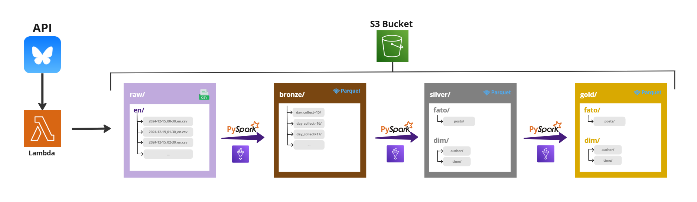
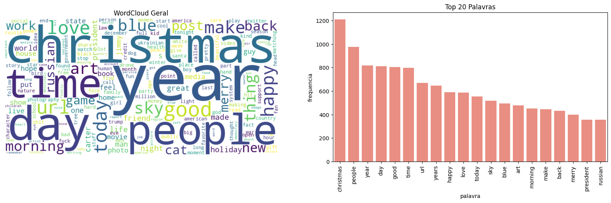
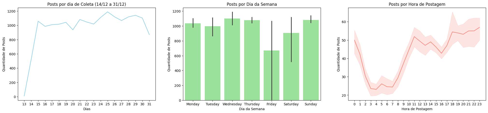
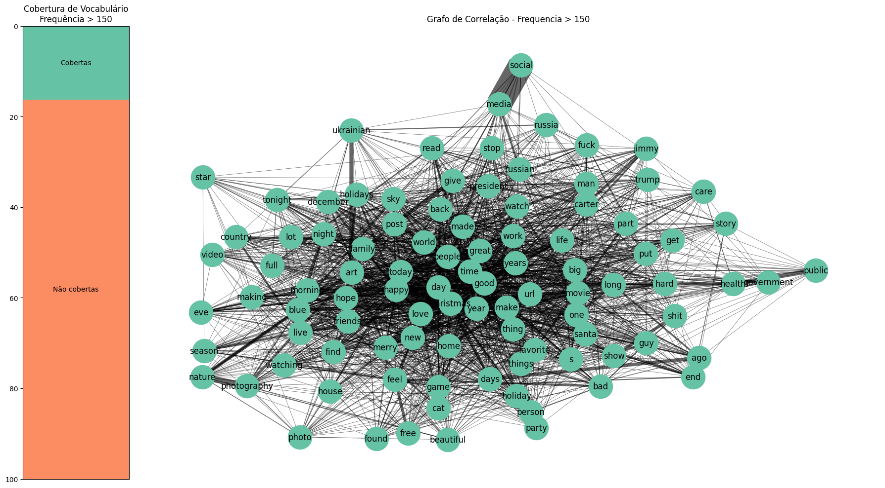
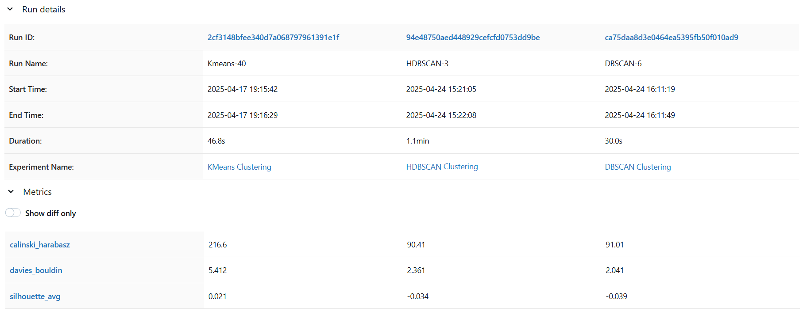

# bsky-seg-topics

O Bluesky é uma plataforma de rede social no formato microblog que surgiu em 2021, criada como prova de conceito para apresentar a ideia de rede social descentralizada, onde os perfis de usuários estão hospedados em servidores que não são necessariamente da empresa dona da rede social. Por ter um formato de uso extremamente parecido com o antigo Twitter, o Bluesky vem atraindo usuários de diferentes nacionalidades. Em janeiro de 2025, a plataforma atingiu os 30 milhões de usuários. O possível crescimento acaba marcando abertura a exploração de público dentro da rede social através de produtores de conteúdo, marcas e publicitários que, mesmo com a recusa do Bluesky na inserção de anúncios nativos, podem investir em comunicação e engajamento o público da rede.

## Coleta de Dados
O bluesky disponibiliza de forma aberta uma biblioteca para python atproto, que fornece interface de cliente para a API da rede social, através do AT Protocol. Com ela é possível realizar acesso a uma conta de usuário e realizar ações de leitura e escrita dentro do perfil, além de gerenciamento de perfil.

A partir do uso dessa API é possivel coletar posts de um feed determinado pelo cliente, podendo ser o feed da conta do usuário cliente ou o feed principal com posts populares, denominado What's Hot. O limite de coleta por requisição é de 100 publicações e não existe limite de requisições.

Sendo assim, considerando o contexto temporal e as características da API, a coleta de posts foi distribuída em torno de 15 dias, com a realização da coleta de 200 posts do feed What's Hot por hora a cada dia. Essa coleta foi orquestrada via função Lambda da AWS e os posts armazenados em formato csv para cada requisição.

| Atributo   | Tipo | Descrição      |
|:------ |:----: |:------:      |
| author  | String    | Usuário autor do post  |
| text    | String    | Texto do post |
| created_at  | Timestamp    | Horário de postagem |
| like_count  | Integer    | Quantidade de likes |
| repost_count  | Integer    | Quantidade de repostagens |
| quote_count  | Integer    | Quantidade de citações |
| reply_count  | Integer    | Quantidade de respostas |

## Datalake de Posts

A coleta de dados dada a partir do fornecimento da API do Bluesky foi feita entre os dias 15 e 31 de dezembro de 2024. Através de um trigger em função Lambda foi possível coletar os posts a cada hora dos 15 dias, na tentativa de amenizar duplicatas considerando os posts em maior evidência. 

Um Bucket S3 foi disponibilizado como datalake inicialmente recebendo os arquivos csv gerados pelo Lambda que em seguida passaram pela orquestração de Jobs do AWS Glue para que ocorresse a disposiçao de arquitetura Medallion, com uma rotina de carga D-1. 

**Camada Bronze:** Disponibilizada de forma particionada, teve como objetivo agregar todo o conjunto de dados em um repositório só, transicionando os dados do formato de coleta(.csv) para parquet. **Camada Silver:** Disponibilizada com o conteúdo dos posts limpos e separados das informações de dimensão. O maior trabalho de limpeza e refinamento em PLN foi realizado aqui, garantindo que o conjunto pudesse ser usado para análise exploratória tardiamente. Além da limpeza de stopwrods, caracteres especiais e valores numéricos, foi realizado um refinamento usando o extrator de palavras chave não supervisionado [YAKE](https://pypi.org/project/yake/), possibilitando maior relevância no conteúdo. **Camada Gold:** Disponibilizada com o conteúdo vetorizado através de um modelo Sentence Tranformer ([all-MiniLM-L6-v2](https://huggingface.co/sentence-transformers/all-MiniLM-L6-v2)) para receber os pipelines de Machine Learning.

## Análise Exploratória
O período de 15 de coleta de postagens do Bluesky envolvendo a API que recolhe registros do feed "What's Hot" levantou a cada hora de cada dia um montante de 100 posts via trigger de Lambda Function. A atividade totalizou uma coleta de aproximadamente 36.000 registros de posts, desconsiderando os posts que estavam em alta no momento da coleta, mas que não pertenciam a uma data no intervalo escolhido. Desse total, após remoção de duplicatas, limpeza de stopwords e extração de palavras-chave (resultando em registros vazios ou nulos onde se encontravam repetições da mesma palavra ou apenas citações de outros posts), esse número decaiu para 18.425 posts.

Foi possível perceber que o período usado para a extração de posts influenciou completamente as palavras mais populares na rede daquele momento, o que era de se esperar. Existe uma evidente diferença entre a palavra mais citada no dataset, relacionada ao natal e a palavra menos citada que provavelmente provém de tópico político.

A distribuição da quantidade de posts conforme os dias do intervalo se manteve com poucas alterações mesmo após a limpeza, levando em fator a soma de posts por todos os dias do período.  Já a distribuição agrupada por dias da semana mostrou uma queda perceptível na sexta-feira (Friday) acompanhada de um alto range do intervalo de confiança. Observando o calendário correspondente ao período, nota-se que o espaço de 16 dias da coleta contemplou 3 vezes os dias Domingo (Sunday), Segunda-feira(Monday) e Terça-feira(Tuesday) equanto que Quarta-feira(Wednesdey), Quinta-feira(Thirsday), Sexta-feira(Friday) e Sábado(Saturday), rotacionaram uma vez a menos. O intervalo de confiança discrepante em Friday pode sugerir um recuo na criação de posts evidentes em uma das 2 datas que contemplam o dia.  A distribuição horária nas postagens mostrou variabilidade explicável, considerando que a coleta de horário se dá em hora local dos posts, sendo maior parte deles dentro de fusos dos Estados Unidos. O trecho com menor contagem na faixa de horario da madrugada consolida a falta de atividade de usuários por sono, além dos picos relativos e absolutos consolidarem os horarios de almoço e fim do dia como periodos de maior atividade. 

### Observando palavras de maior frequência

O vocabulário do conjunto de dados reuniu em todo aproximadamente 23.385 palavras citadas e adotadas como palavras chave ou de evidência para identificação. Consultando arbitrariamente as palavras mais usadas com frequencia em posts acima de 150, foi extraído um total de 97 palavras mais citadas, representando 0,4% de todo o vocabulário. A cobertura, que determina quantos posts do dataset possuem ao menos uma das 97 mais citadas apresenta valores abaixo dos 20%, o que esclarece a possivel discrepância entre a presença de tópicos mais definidos e a presença de tópicos mais individuais, além de uma alta variabilidade de vocabulário de menor frequência.  A rede de relações entre essas 97 palavras mais uma vez endossa a presença do feriado nas conversas da plataforma no período, uma vez que ao centro do grafo, onde vemos palavras relacionadas às festas, está a parte mais pesada de vértices. Ao redor, é possivel encontrar relações a assuntos políticos ('public' <> 'health'), artisticos ('nature' <> 'photography') e diversos ('social' <> 'media').

## Clustering
A ideia para o projeto é encontrar estratégias de segmentação que possam trazer uma apresentação de tópicos dentro dos dados coletados. Para isso, foram considerados algoritmos de clustering de dados. Nesse estudo foram escolhidos três modelos que passaram por avaliação com permutação de hiperparâmetros (Grid Search) e em seguida produziram resultados para uma matriz de coocorrência com seus melhores resultados avulsos.
Para os três algoritmos testados foram disponibilizados os dados vetorizados do DataLake e transformados de forma escalar em dois formatos: 
- **RobustScaler**: dimensionamento dos embeddings de acordo com seu IQR (intervalo inter-quartil). Útil em padronizar dados com outliers ou ruídos.
- **MinMaxScaler**: dimensionamento dos embeddings no intervalo [0,1] de forma padrão, usando valores maximo e mínimo. 

Entre os algoritmos avaliados estão **KMeans**, **DBSCAN** e **HDBSCAN**.

Usando o Mlflow, inicialmente foi realizada uma avaliação para cada tipo de modelo através de **Grid Search**, contando como estimativa de alguns paramêtros a observação do comportamento dos dados aos modelos, como no caso do Kmeans, onde foi utilizado o Elbow Method (Método do Cotovelo) para determinar em quais valores de K a inércia do modelo sofreria alteração. O método também foi usado para estipular valores para DBSCAN observando o comportamento do valor de epsilon (raio de área mínima para formação de um cluster) em relação aos dados. Ao todo, foram feitas mais de 300 execuções nos experimentos destinados a cada tipo de modelo para definir os melhores parametros para o Clustering Ensemble. Nos experimentos do Mlflow, foram registrados os hiperparâmetros de cada execução, bem como as métricas de avaliação básicas: **silhoute, davies bouldin e calinski harabasz**.

De forma geral, a medição das métricas baixas permaneceu abaixo do satisfatório para quase todas as execuções dos experimentos. A estimativa é de que a formação de clusters no conjunto de dados se dá com áreas muito pequenas, o que abre potencial para uma quantidade elevada e fora de possibilidade de observação de clusters, o que aumentou o nível de ruído nos hiperparâmetros mais adequados. No algoritmo que não apresenta formação de clusters por área, o Kmeans, a quantidade K que demonstrou melhor desempenho foi K=9.

Sendo assim, o ensemble foi composto de três camadas advindas dos algoritmos mencionados, que produziram seus respectivos agrupamentos e esses resultados foram sumarizados em uma matriz de coocorrência, que determina quais dados foram agrupados pelos 3 algoritmos no mesmo rótulo. Essa matriz de coocorrência é submetida a um novo processo de clustering através do algoritmo **AglomerativeClustering**, produzindo assim a rotulação final para o conjunto de dados.

## Resultados
